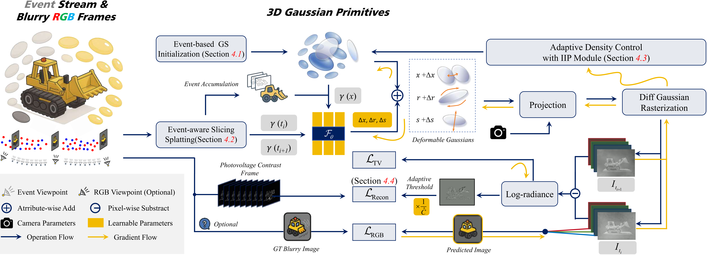
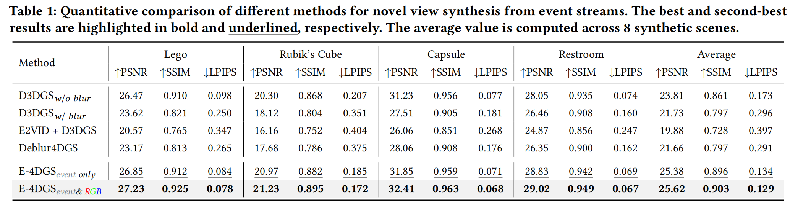
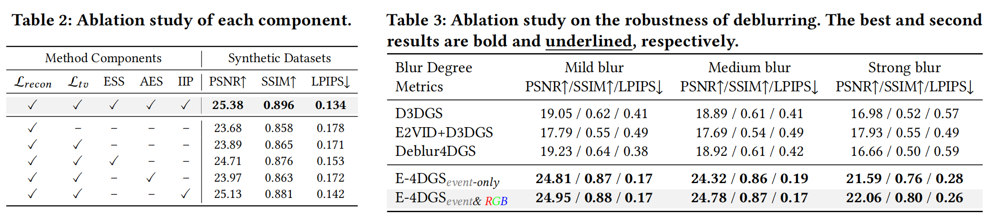

<h2 align="center"> 
  <a href="https://github.com/SuperFCR/E-4DGS"> E-4DGS: High-Fidelity Dynamic Reconstruction from the Multi-view Event Cameras</a>
</h2>
<h5 align="center"> 
If you like our project, please give us a star ⭐ on GitHub for latest update.  </h5>
<h5 align="center">

<!-- [](https://arxiv.org/) -->
[](https://github.com/SuperFCR/E-4DGS/blob/main/LICENSE) 
[](https://github.com/SuperFCR/E-4DGS/stargazers)&#160;
[](https://github.com/SuperFCR/E-4DGS/network)&#160;
[](https://github.com/SuperFCR/E-4DGS/watchers)&#160;


</h5>Implemetation of "E-4DGS: High-Fidelity Dynamic Reconstruction from the Multi-view Event Cameras". We are currently organizing the data and code 🔥.




## 🍭 Novel Synthesis Results
### 🌅 Qualitative comparison


### 📊 Quantitative comparison


<div class="is-centered">
    <figure style="text-align: center;">
        
    </figure>
</div>


<div class="is-centered">
    <figure style="text-align: center;">
        
    </figure>
</div>

<!-- <h2>
  
  Acknowledgements
</h2> -->
## 🙏 Acknowledgements

This source code is derived from multiple sources, in particular: 
[gaussian-splatting](https://github.com/graphdeco-inria/gaussian-splatting/tree/main). We thank the authors for releasing their code.

```bibtex

To be contunied...

```

## 🤝 Contributors

<a href="https://github.com/SuperFCR/E-4DGS/graphs/contributors">
  
</a>